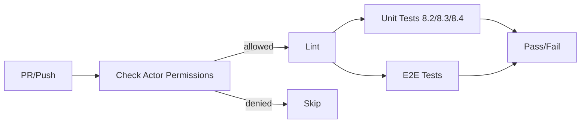

# Workflow

## Issue Lifecycle

### Creating an Issue

Issues track bugs, feature requests, improvements, and technical debt.

**Title format:** `[Tag] Short description`

Tags used:
| Tag | When to use |
|-----|-------------|
| `[Bug]` | Something doesn't work as documented/expected |
| `[Security]` | Vulnerability, trust boundary, validation gap |
| `[Reliability]` | Crash, hang, data loss, retry problems |
| `[Memory]` | Leak, unbounded growth, reference cycle |
| `[Maintainability]` | Duplicated code, oversized API, technical debt |
| `[Tests]` | Missing or weak tests, flaky tests |
| `[Info]` | Low-priority hygiene, documentation, minor improvements |

**Issue body template:**

```
## Context / Problem
[Clear description of what the problem is and why it matters]

## Affected files / locations
[Files and line numbers relevant to the issue]

## Proposed approach
[Optional: suggested solution or direction]

## Acceptance Criteria
- [ ] [concrete, testable outcome]
- [ ] Unit test(s) added where applicable
- [ ] Changelog entry added
- [ ] Post-implementation comment posted on this issue describing what was changed

## Severity
[Critical / High / Medium / Low / Info]
```

### Triaging

- Issues are triaged by maintainers
- Labels are applied: `bug`, `security`, `enhancement`, `good first issue`, etc.
- Priority is assigned based on severity and impact

### Fixing an Issue

1. Assign yourself to the issue (or comment that you're working on it)
2. Create a branch from `master`: `fix/issue-NNN-short-description` or `feat/NNN-short-description`
3. Implement the fix following the development workflow below
4. Open a Pull Request targeting `master`
5. PR must pass CI (lint + unit tests + integration tests)
6. PR is reviewed by at least one maintainer
7. Squash-merge into `master`
8. Comment on the issue describing what was changed

## Development Workflow

### Before Committing

```bash
composer lint:fix  # Fix auto-fixable issues (Rector + PHPCBF)
composer lint      # Verify all checks pass (PHPCS + Rector dry-run + PHPStan)
```

### If Lint Fails

- Fix errors that cannot be auto-fixed manually
- Check again: `composer lint`

### Before Pushing

Both must pass:

```bash
composer lint   # No errors
composer test   # All tests pass (unit + integration where applicable)
```

### Testing

```bash
composer test                # All tests
composer test:unit           # Unit tests only (no FDB required)
composer test:integration    # Integration tests (requires running FDB cluster)
```

Integration tests require Docker:

```bash
docker compose up -d
docker compose exec php vendor/bin/phpunit --testsuite=Integration
docker compose down -v
```

### Code Quality Tools

| Tool | Command | Purpose |
|------|---------|---------|
| PHPCS | `composer cs` | Coding style (PSR-12 + Slevomat) |
| PHPCBF | `composer cs-fix` | Auto-fix coding style |
| Rector | `composer rector` | Auto-fix code quality, dry-run |
| Rector (fix) | `composer rector:fix` | Apply Rector fixes |
| PHPStan | `composer phpstan` | Static analysis, level 9 |

## Pull Request Workflow

1. PR title: `fix(#NN): description` or `feat(#NN): description` where `NN` is the issue number
2. PR description should reference the issue: `Closes #NN`
3. CI runs automatically for collaborators (owner, maintainers, write-access)

### CI Pipeline



**Lint job:** PHPCS → Rector (dry-run) → PHPStan

**Unit tests:** Run on PHP 8.2, 8.3, 8.4

**E2E tests:** 5-node FDB cluster in Docker, integration test suite

## Release Workflow

1. Tag the release: `git tag vX.Y.Z`
2. Push tag: `git push origin vX.Y.Z`
3. CI runs on tag push
4. Update `CHANGELOG.md` with the new version

## Changelog

All notable changes are documented in `CHANGELOG.md` following the [Keep a Changelog](https://keepachangelog.com/) format.

Sections:
- **Added** for new features
- **Fixed** for bug fixes
- **Changed** for changes in existing functionality
- **Deprecated** for soon-to-be removed features
- **Removed** for removed features
- **Security** for vulnerability fixes

Each entry references the issue number: `[#NN] Description`
